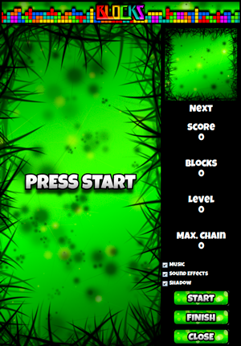

# TetrisMaster
This is a Java desktop application that contains two games in one. The first game is a very popular classic game known as 'Tetris'. The second game is a Tetris adaptation which I called 'Blocks'. The purpose of this project is showing how to program a puzzle game in Java making use of all the power of the Object Oriented Programming (OOP).

## Tetris
The mechanics of this game is very simple. Complete horizontal lines in order to make them disappear. The more lines you complete at once, the higher score you get. Be careful, every 10 lines completed, you go one level up and all blocks will fall down faster. You lose when any block touches the top of the stage once it has stopped falling down.

## Blocks
The mechanics of this game are a little different from Tetris mechanics. You still have the same blocks falling down and a new block will join the family. The idea of this game is grouping block of the same color. Every time you have grouped 5 or more squares of the same color, the whole group will disappear, making the rest of the blocks on top (if any) fall down. The more blocks you make disappear in a chain, the higher score you get. Be careful, every 10 blocks disappeared, you go one level up and blocks will fall down faster. You lose when any block touches the top of the stage once it has stopped falling down.

